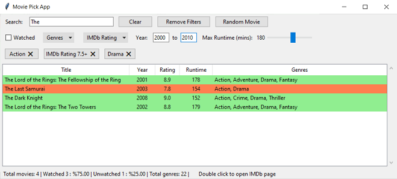
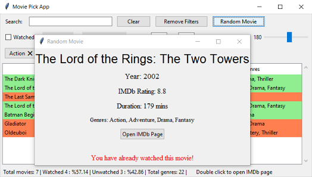

# Movie Picker App
The Movie Picker App is a Python application that helps users browse and filter through their movie collection. It allows users to search, filter, and randomly select movies based on various criteria such as genre, IMDb rating, runtime, and year.

### Features
- Browse and search through a list of movies
- Filter movies by genre, IMDb rating, year range, and runtime
- Display the number of watched and unwatched movies
- Randomly select a movie and display its details
- Open the IMDb page for a movie with a double-click
- Sort movies by title, year, rating, runtime, and genres

### Files
- watchedlist.csv : The list of movies, i have watched exported from IMBd.
- watchlist.csv   : The list of movies in my watchlist exported from IMBd.
- csv_prep.ipynb  : Jupyter Notebook for preprocessing the movie data and creating the movie_list.csv file.
- movie_list.csv  : The preprocessed movie data file.
- movie_picker.py : The main Python script that runs the Movie Picker App.
- run.bat         : Open to run the movie_picker.py

### Screenshots

 

